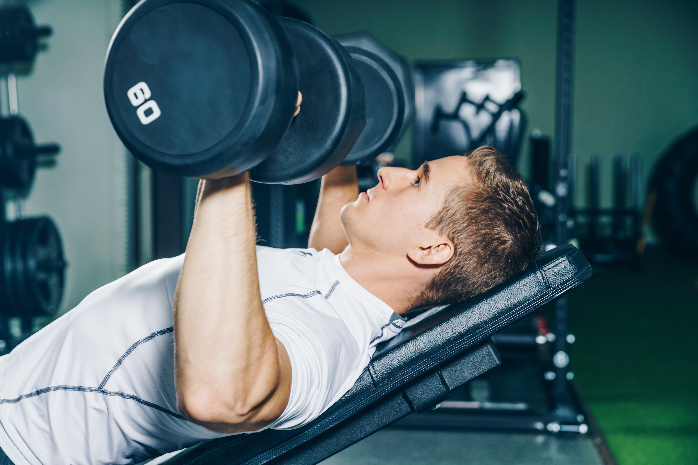

Fitness is the state of being physically sound. It ranges from not being physically challenged, obesed, bedriddren,weak due to illness, to being physically sound with flabby or toned muscles.
when one is physically sound, he or she can increase his or her general or overall fitness by 'exercising'.
<<<<<<< HEAD
This three syllabic word **exercise** is very powerful than it sounds!!
=======
This three syllabic word **exercise** is very powerful than it sounds!!

>>>>>>> 2fc743038e36c42dd787fbe8c4aaf049f4f09a93
